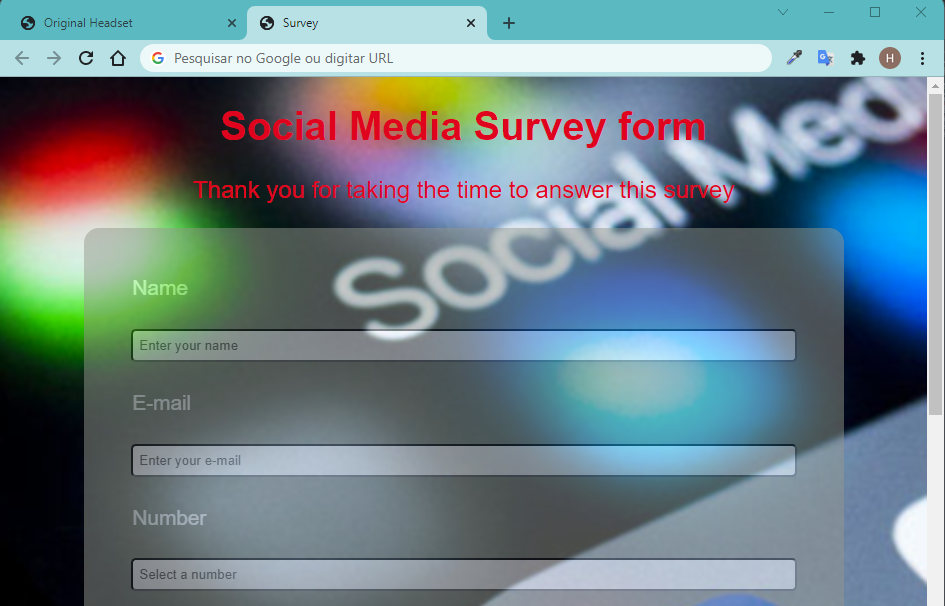

# Survey Form

  

## FreeCodeCamp's second responsive web design project based on the following user stories:
  

### Objective: Build an app that is functionally similar to <a>https://survey-form.freecodecamp.rocks</a>
 

1. You should have a page title in an <strong>h1</strong> element with an <strong>id</strong> of <strong>title</strong>
   
2. You should have a short explanation in a <strong>p</strong> element with an <strong>id</strong> of description
   
3. You should have a <strong>form</strong> element with an <strong>id</strong> of survey-form
   
4. Inside the <strong>form</strong> element, you are <strong>required</strong> to enter your name in an <strong>input</strong> field that has an <strong>id</strong> of name and a type of text
   
5. Inside the <strong>form</strong> element, you are <strong>required</strong> to enter your email in an <strong>input</strong> field that has an <strong>id</strong> of email
   
6. If you enter an email that is not formatted correctly, you will see an HTML5 validation error
   
7. Inside the <strong>form</strong>, you can enter a number in an <strong>input</strong> field that has an <strong>id</strong> of number
   
8. If you enter non-numbers in the number <strong>input</strong>, you will see an HTML5 validation error
   
9. If you enter numbers outside the range of the number <strong>input</strong>, which are defined by the min and max attributes, you will see an HTML5 validation error
    
10. For the name, email, and number input fields, you can see corresponding <strong>label</strong> elements in the form, that describe the purpose of each field with the following ids: <strong>id="name-label"</strong>, <strong>id="email-label"</strong>, and <strong>id="number-label"</strong>

11. For the name, email, and number input fields, you can see placeholder text that gives a description or instructions for each field

12. Inside the form element, you should have a <strong>select dropdown</strong> element with an id of dropdown and at least two options to choose from

13. Inside the form element, you can select an option from a group of at least two radio buttons that are grouped using the name attribute

14. Inside the form element, you can select several fields from a series of checkboxes, each of which must have a value attribute

15. Inside the form element, you are presented with a textarea for additional comments

16. Inside the form element, you are presented with a button with id of submit to submit all the inputs

<strong></strong>

